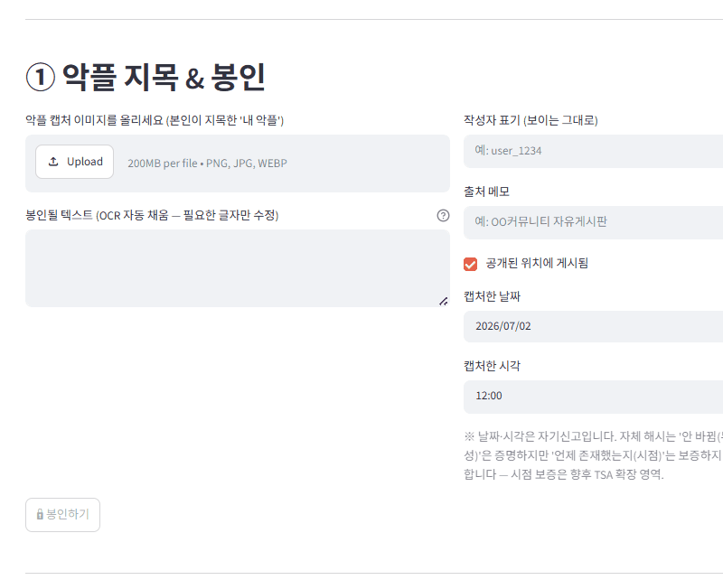
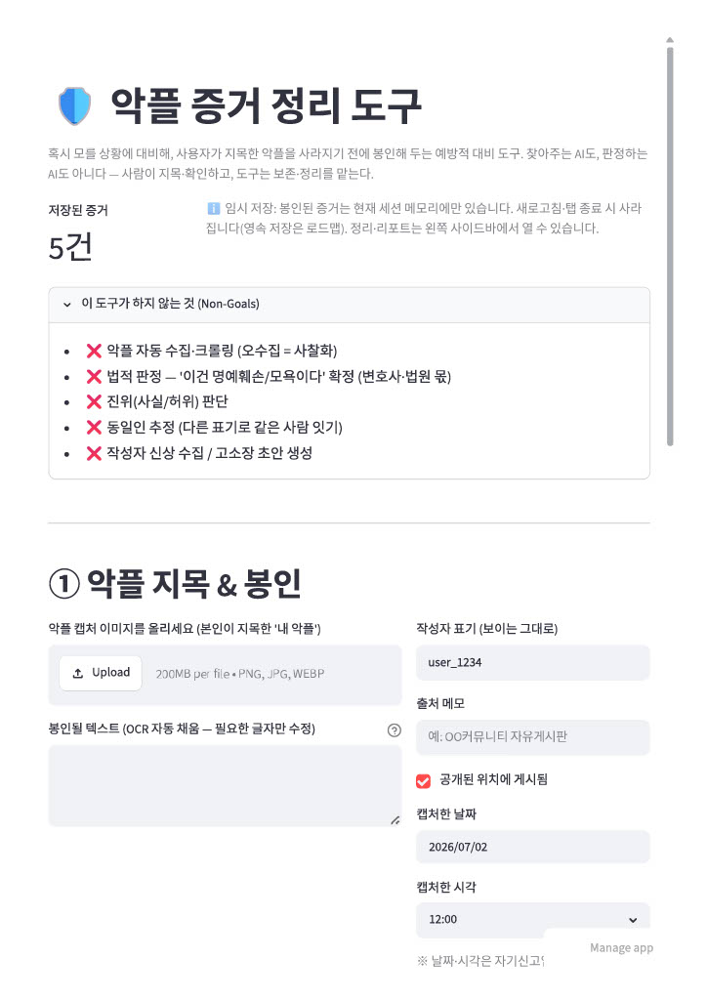
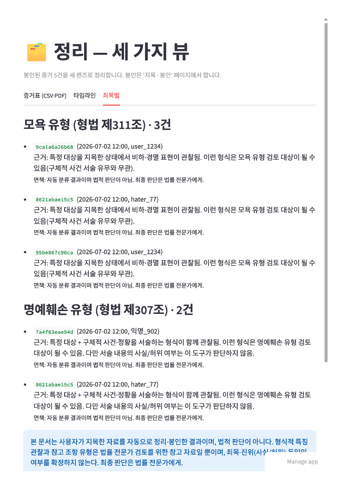
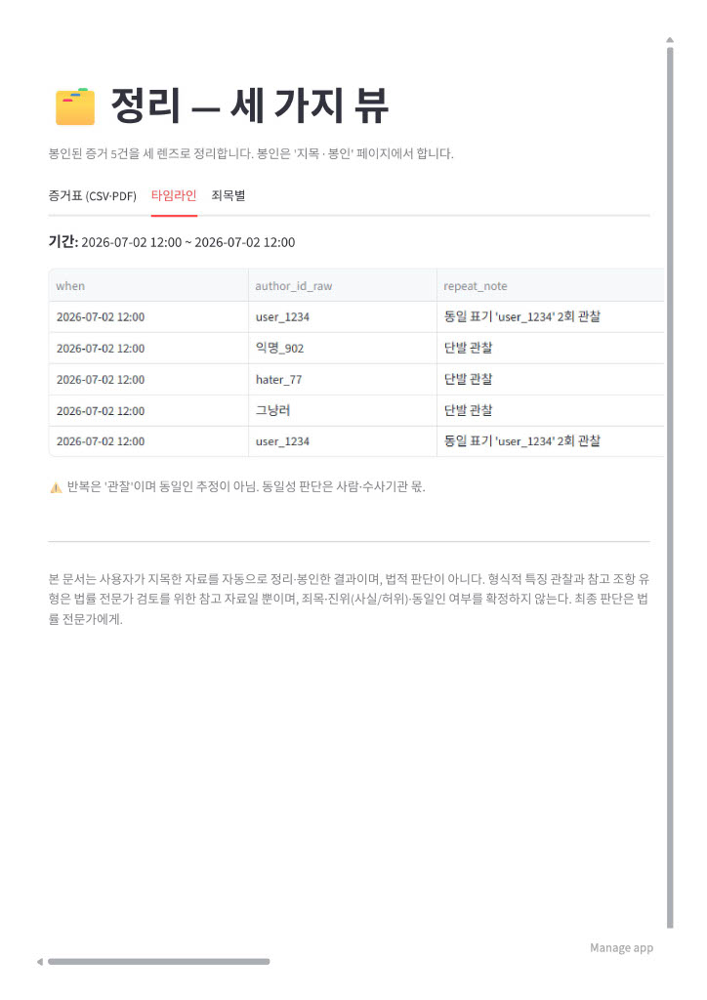
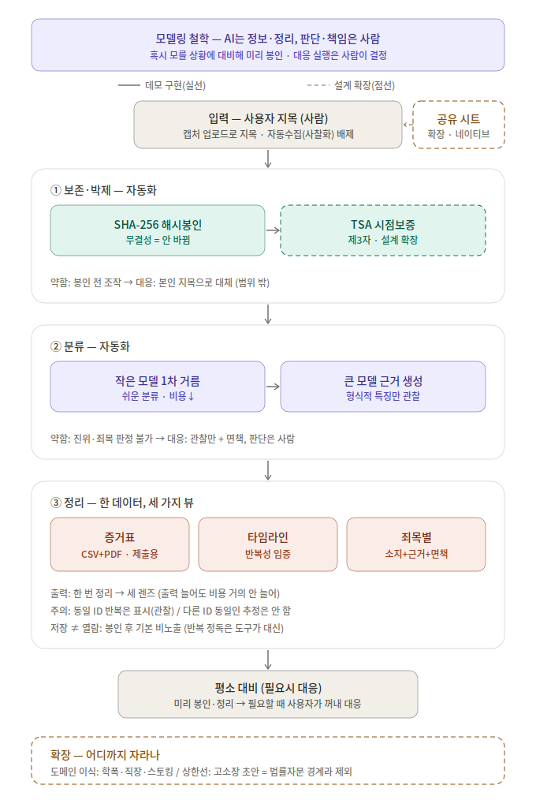
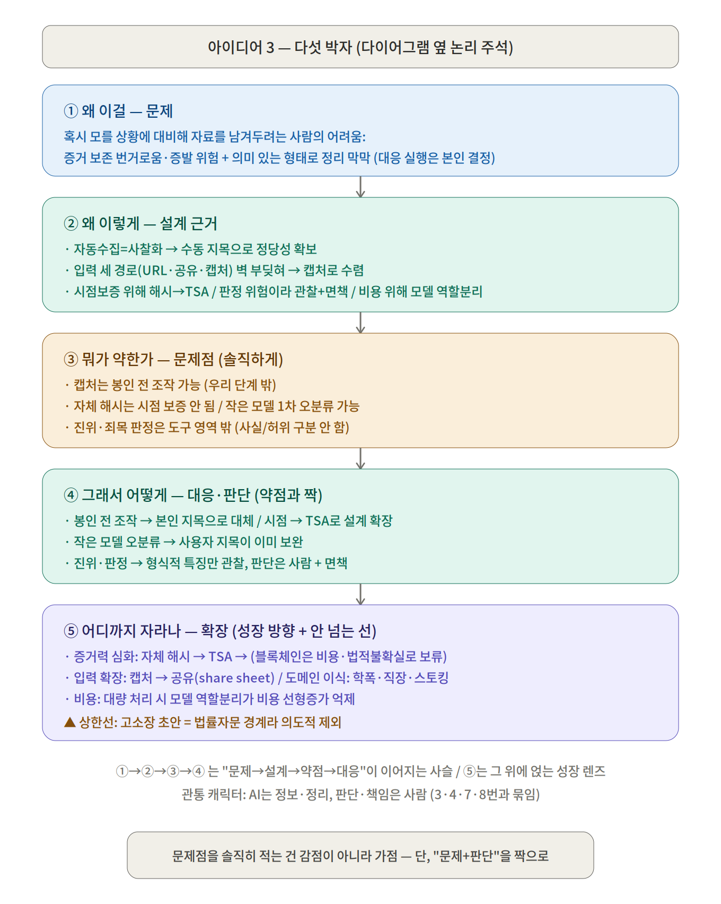
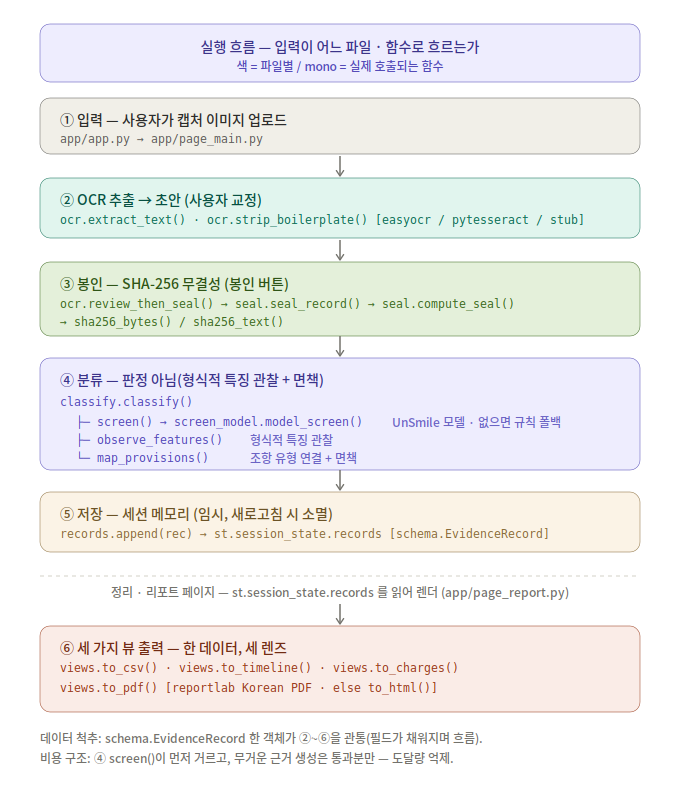
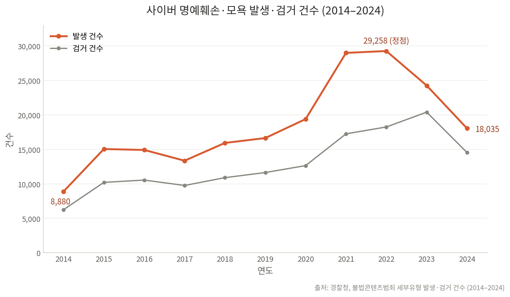

# Comment-Evidence-Organizer (악플 증거 정리 도구)
> 혹시 모를 상황에 대비해, 사용자가 지목한 악플을 사라지기 전에 봉인해 두는 증거 정리 도구

[](https://comment-evidence-organizer-syh1109.streamlit.app/)


---

## 한 줄 소개 (Overview)

인터넷에서 악플을 접한 사람이 **직접 지목한 악플**을, 상대가 지우기 전에 **위변조 불가능하게 봉인**해 두는 도구. "지금 당장 고소하려는 사람"보다 **"혹시 모를 상황에 대비해 평소 자료를 남겨두려는 사람"**을 위한 예방적 대비 도구에 가깝다.

- **평소 대비가 주(主), 대응은 그 위에 얹히는 결과.** 미리 봉인·정리해 두면, 나중에 실제로 신고·고소·상담이 필요할 때 그대로 꺼내 쓸 수 있다. 대비가 목적이고, 대응은 그 덕분에 쉬워지는 부수 효과.
- **찾아주는 AI가 아님.** 무엇이 악플인지는 본인이 제일 잘 안다 → 사람이 지목, 도구는 그 다음(보존·분류·정리)을 자동화한다.
- **판단하는 AI가 아님.** "이건 명예훼손이다" 같은 법적 판정은 하지 않는다. 도구는 정보·정리, **판단·책임은 사람**.
- **대응 종류·실행 여부는 사용자가 결정한다.** 도구는 결과가 아니라 '대비'를 돕는다.

---

## 왜 만드나 (Motivation / Problem)

악플을 접했을 때, 당장 어떻게 할지는 몰라도 **"일단 남겨는 둬야 하는데"** 싶은 순간이 있다. 그런데 막상 남기려면:

1. **증거 보존이 번거롭고 불안하다** — 캡처를 일일이 떠야 하고, 상대가 지우면 증발하고, URL·날짜·작성자 ID가 누락되기 쉽다.
2. **모아둔 걸 의미 있는 형태로 정리하기 막막하다** — 언제·누가·어디서·무슨 표현을, 표 형태로 정돈하는 게 일반인에겐 어렵다.

그래서 "혹시 몰라 대비하려는" 다수는 대개 **아무것도 안 남기고 지나간다.** 나중에 정말 필요해졌을 때는 이미 증거가 사라진 뒤다.

기존에도 로펌 디지털 증거 서비스·대응 업체가 있지만 대부분 **일이 터진 뒤에 쓰는 수동·고비용** 서비스다. "개인이, 평소에, 부담 없이 미리 남겨두는" 대비 도구는 빈칸.

---

## 데모 (Demo)

**라이브 데모:** [https://comment-evidence-organizer-syh1109.streamlit.app/](https://comment-evidence-organizer-sample-project.streamlit.app/)

> 아래 화면은 모두 **더미(가상) 데이터**로 시연한 것입니다. 실제 인물·사건과 무관합니다.

### OCR 자동 추출 — 피해자가 악플을 다시 쓰지 않게


캡처를 올리면 OCR이 자동으로 텍스트를 채운다. 사용자가 자기 악플을 직접 다시 타이핑하는 **입력 단계의 2차 노출**을 피하려는 설계(틀린 글자만 교정).

### 메인 — 지목·봉인 + '하지 않는 것' 명시


사용자 지목 → 봉인 흐름, 상단 '저장된 증거 N건' 지표, Non-Goals(자동수집·판정·진위·동일인 추정·신상수집을 하지 않음)를 앞면에 명시.

### 정리 — 죄목별 (판정이 아니라 참고 + 면책)


모욕/명예훼손 '유형'별로 묶고 **근거 + 항목별 면책**을 함께 제시. 확정하지 않으며, 소지가 있으면 둘 다 참고로 띄운다.

### 정리 — 타임라인 (반복은 '관찰', 동일인 추정은 안 함)


시간순 정렬 + 같은 작성자 표기의 반복을 '관찰'로 표시(예: `user_1234` 2회). 다른 표기를 같은 사람으로 잇는 추정은 하지 않는다.

---

## 처리 흐름 (Pipeline)

사람 몫과 자동화를 명확히 가른 5단계. (상세 다이어그램은 [아키텍처](#아키텍처-architecture) 참조)

| 단계 | 담당 | 하는 일 |
|---|---|---|
| ① 발견 | 사람 | 어디에 달렸는지 본인이 확인 |
| ② 수집·지목 | 사람 | 캡처로 "이건 나한테 달린 악플"이라고 지목·입력 |
| ③ 보존·박제 | 자동 | 무결성 봉인 (해시) — 안 바뀜을 증명 |
| ④ 분류 | 자동 | 형식적 특징 관찰 + 근거 + 면책 (판정 아님) |
| ⑤ 정리 | 자동 | 한 데이터를 세 가지 뷰로 출력 |
| 대응 준비 | 사람 | 고소·신고·기록 중 사용자가 결정 |

> **핵심:** 1~2단계(발견·수집)는 사람 몫, 진짜 가치는 3~5단계. "수집 자동화를 못 하는 게 아니라, 가치가 거기 없다."

---

## 주요 기능 (Features)

- **캡처 입력 (OCR)** — 스크린샷을 올리면 텍스트화. 로그인 벽 뒤·폐쇄공간·삭제된 글까지 커버되는 유일한 입력 경로.
- **무결성 봉인** — 캡처/전문의 SHA-256 해시를 증거에 기록해 "제출 후 안 바뀜"을 증명.
- **형식적 특징 분류** — 특정인 지목·공개 위치·비하 표현 같은 겉으로 보이는 요소를 관찰하고, 관련 조항 유형을 **참고용**으로 연결(+면책). 진위·죄목은 판정하지 않음.
- **증거 정리 (세 가지 뷰)**
  - **증거표** — CSV(가공용) + PDF(제출용)
  - **타임라인** — 시간순 정렬로 지속성·반복성 표시 (작성자 ID는 원본 그대로 병기)
  - **죄목별** — 관련 조항 유형별 묶음 + 근거 + 면책
- **내용 최소 노출** — 봉인된 증거는 기본적으로 원문을 다시 보여주지 않고 표지 정보(날짜·건수·상태)만 표시. 반복 정독은 도구가 대신하고, 원문은 사용자가 명시적으로 펼칠 때만 노출.

> 각 기능의 실제 동작 화면은 상단 **데모** 섹션 참조.

---

## 아키텍처 (Architecture)

전체 설계도(통합 흐름 + 데모/설계 경계 + 다섯 박자).





**실행 흐름 (구현) — 입력이 어느 파일·함수로 흐르는가.** 위 통합 설계도가 "무엇을·왜"(개념)라면, 아래는 "어떻게 구현했나"(코드)다. 캡처 업로드 → OCR → SHA-256 봉인 → 분류(모델/규칙) → 세션 저장 → 세 가지 뷰까지, 실제 호출되는 함수를 파일별 색으로 표시한다.



- 통합 흐름도(개념): `idea3_diagram.svg` / `.png`
- 실행 흐름도(코드): `idea3_codeflow.svg` / `.png`
- 다섯 박자 논리 카드: `idea3_five_beats.svg` / `.png`

### 비용 제약 (Cost Constraint)

이 도구에서 저비용은 "최적화하면 좋은 것"이 아니라 **넘으면 안 되는 제약 조건**이다.

- **이유 (제품 성격):** 이 도구는 "지금 고소하려는 사람"보다 *"혹시 모를 상황에 대비해 평소 자료를 남겨두려는 사람"*을 위한 **예방적 대비 도구**에 가깝다. 보험처럼 **평소에 부담 없이 쌓아둬야** 의미가 있는데, 자료를 넣을 때마다 비용이 나가면 아무도 미리 대비하지 않는다. 따라서 저비용은 부가 혜택이 아니라 **이 서비스가 성립하기 위한 전제**다.
- **그래서 설계 방향:** 큰(비싼) 모델 호출을 최소화한다. OCR·해시 단계는 애초에 LLM이 아니라 비용이 없고, 실제 비용은 ④분류의 모델 호출에 집중된다. 여기서 **작은/로컬 모델이 1차로 거르고(악플 후보 vs 일반), 걸러진 소수만 큰 모델이 근거 생성**을 맡아 큰 모델 도달량을 줄인다.
- **정확도 보완:** 작은 모델이 1차에서 놓쳐도 **사용자가 이미 지목한 상태**라 사람이 잡는다 → 싼 모델을 써도 안전.
- **미결 (고찰 중):** 큰 모델을 **로컬/오픈소스(서버·전기 부담, API비 0)** 로 돌릴지, **외부 API(토큰 비용)** 로 돌릴지는 위 제약 아래에서 결정 예정. <!-- TODO: 로컬 vs API 결정 — 비용 제약 우선 -->

> 이 도구는 사용자 지목분만 처리해 원래 호출량 자체가 적다. 요점은 "얼마 아꼈다"가 아니라, **평소 부담 없이 쌓아두는 대비 도구라는 성격상, 비용이 커지면 아무도 미리 대비하지 않아 제품이 무의미해지는 구조**라 저비용을 제약으로 깔고 설계했다는 점.

### 이렇게 구현했다 (현재)

위 방향을 실제로 이렇게 구현했다.

- **1차 거름(`screen`)을 실제 모델로 구현.** 사전학습 한국어 혐오·악플 분류 모델(`smilegate-ai/kor_unsmile`)을 '작은 모델' 자리에 붙여 악플 후보 여부를 거른다. 이 모델은 **외부 API가 아니라 로컬/배포 서버에서 직접 실행**되어 토큰 과금이 없다. 무료 Streamlit Cloud에서 실제 구동을 확인했다(사이드바 '분류 엔진' 배지로 모델/규칙 상태를 표시).
- **자원·라이선스 안전을 코드로.** 모델을 못 불러오면(미설치·네트워크·자원 부족) 조용히 규칙 스텁으로 폴백한다 — 비용 0, 앱도 죽지 않음. 모델 파일은 저장소에 넣지 않고 실행 시 로드만 한다(라이선스상 재배포 아님).
- **정확도 보완(구현됨).** 사용자 지목(`user_flagged`)이 안전망이라, 작은 모델이 놓쳐도 사람이 이미 지목한 상태다 → 느슨한 임계로 싸게 걸러도 안전.
- **큰 모델(근거 생성)은 아직 규칙 템플릿 스텁.** 실제 LLM 연결은 다음 단계이며, 현재 LLM API 호출은 0이다. 붙일 때도 "`screen` 통과분에만" 호출해 도달량을 억제하는 구조는 그대로 유지한다.

---

## 설치 (Installation)

```bash
git clone <repo-url>
cd comment-evidence-organizer
python -m venv .venv && source .venv/bin/activate   # Windows: .venv\Scripts\activate
pip install -r requirements.txt
```

**요구 사항 (Requirements)**
- **Python 3.10+** (타입 표기 `list[...]`, `X | None` 사용)
- **OCR 엔진 (로컬에서 자동 추출하려면 택1)** — 캡처에서 텍스트를 자동으로 읽어와, 사용자가 악플을 다시 타이핑하지 않게 하는 핵심.
  - `pip install easyocr` — 한국어 강함, pip만으로 설치(윈도우 편함). 첫 실행 시 모델 다운로드로 느림.
  - 또는 **tesseract 엔진 + 한국어 데이터** 설치(가벼움·빠름). 윈도우는 별도 설치기 필요.
    PATH에 없으면 `TESSERACT_CMD` 환경변수로 실행파일 경로 지정 가능:
    `set TESSERACT_CMD=C:\Program Files\Tesseract-OCR\tesseract.exe`
  - (엔진이 없으면 자동 추출이 비활성 — 배포에서는 `packages.txt`가 tesseract를 자동 설치하므로 문제 없음.)
- **PDF 제출본:** `reportlab`(requirements에 포함, 내장 한국어 폰트). 없으면 HTML로 폴백.

---

## 사용법 (Usage)

```bash
streamlit run app/app.py
```

기본 흐름: 캡처 업로드 → OCR 자동 추출·교정 → 봉인(해시) → 형식적 특징 분류 → 세 가지 뷰로 출력 → CSV/PDF로 내보내기.

---

## 배포 (Deployment) — Streamlit Community Cloud (무료·공개)

1. GitHub에 push (레포 **루트**에 `app/ src/ requirements.txt packages.txt`가 바로 보이게).
2. `share.streamlit.io` → GitHub 로그인 → **Create app** → 레포·브랜치 선택.
3. **Main file path = `app/app.py`** 로 지정 (기본값 `streamlit_app.py` 아님 — 반드시 변경).
4. Deploy. 빌드 시 `packages.txt`(apt)로 tesseract가 자동 설치돼, 로컬과 달리 OCR이 바로 작동한다.

> ⚠️ **배포에서 밟았던 함정 두 가지 (재발 방지 메모)**
> - **`packages.txt`는 주석(`#`)을 지원하지 않는다.** 모든 줄을 패키지 이름으로 읽으므로,
>   설명 주석을 넣으면 `E: Unable to locate package …` 로 빌드가 실패한다. **패키지 이름만** 적을 것.
>   (반면 `requirements.txt`는 `#` 주석 OK.)
> - **Main file path 기본값이 `streamlit_app.py`** 라, `app/app.py`로 바꾸지 않으면 엉뚱한 파일
>   (예: 노트북)이 진입점으로 잡힌다.

---

## 폴더 구조 (Project Structure)

> 초기 골격 + 제작하며 채워지는 파일. 빈 폴더는 `.gitkeep`으로 추적.
> 표기: `✅` = 작성됨 / (그 외) = 예정.

```
├─ app/                        # Streamlit 멀티페이지 앱 (st.navigation)
│   ├─ app.py                  # ✅ 라우터: 공통설정·경로·세션 + 사이드바(한글 라벨)
│   ├─ page_main.py            # ✅ '지목 · 봉인': 지표(저장 N건) + ① 지목·봉인 + ② 봉인 증거(표지)
│   └─ page_report.py          # ✅ '정리 · 리포트': ③ 세 가지 뷰(증거표 CSV+PDF / 타임라인 / 죄목별)
├─ src/                        # 핵심 파이프라인 로직 (notebooks에서 검증된 것을 정리)
│   ├─ schema.py               # ✅ 증거 레코드 스키마 — 이 프로젝트의 '척추'
│   ├─ seal.py                 # ✅ SHA-256 무결성 봉인 + 검증(변조 탐지)
│   ├─ ocr.py                  # ✅ 캡처 → 텍스트 (엔진 교체 가능 + 초안→교정→봉인)
│   ├─ classify.py             # ✅ 형식적 특징 분류 (작은/큰 모델 2단, [MODEL] 슬롯)
│   ├─ screen_model.py         # ✅ screen() 백엔드: 사전학습 UnSmile 모델(있으면)→규칙 폴백
│   └─ views.py                # ✅ 한 데이터 → 세 뷰(증거표 CSV+PDF / 타임라인 / 죄목별)
├─ notebooks/                  # 실험용 — 로컬/오픈소스 모델로 분류 프롬프트·성능 튜닝
│   └─ classify_experiment.py  # ✅ 분류 '출력 계약' 프로토타입 (→ src/classify.py로 승격됨)
├─ models/                     # 로컬 모델 파일 (실험용, 수 GB → .gitignore 대상)
├─ data/                       # 원본/샘플 데이터 (실제 증거 X — 더미·샘플만)
├─ database/                   # 전처리 데이터, SQL
├─ docs/                       # 다이어그램·추이그래프·데이터·설계문서 (README가 참조)
│   ├─ idea3_diagram.svg/.png
│   ├─ idea3_codeflow.svg/.png
│   ├─ idea3_five_beats.svg/.png
│   ├─ cyber_defamation_trend.svg/.png
│   ├─ police_cybercrime_2014_2024.csv
│   ├─ evidence_report_sample.pdf   # 더미 3건으로 생성한 출력 예시(실제 증거 X)
│   └─ screenshots/                 # README 데모용 스크린샷·GIF
│       ├─ demo_ocr_autofill.gif
│       ├─ main_overview.jpg
│       ├─ report_charges.jpg
│       └─ report_timeline.jpg
├─ .gitignore                  # 민감정보(업로드·출력) + 모델 파일 + 키 제외
├─ requirements.txt            # 파이썬 의존성 (streamlit·pandas·Pillow·pytesseract·reportlab)
├─ packages.txt                # 배포(Streamlit Cloud) 시스템 패키지: tesseract-ocr(-kor)
├─ LICENSE
└─ README.md
```

- **작성된 파일 (현재) — 파이프라인 뼈대 완성:**
  - `src/schema.py` — 봉인된 악플 1건의 필드 정의. 세 뷰·분류기가 공유하는 단일 레코드. Non-Goals가 '필드의 부재'로 못박혀 있음(verdict/is_factual/same_person_as 없음).
  - `src/seal.py` — SHA-256으로 이미지·텍스트·메타데이터를 묶어 봉인(`seal_digest`) + 검증(변조 시 어느 조각이 바뀌었는지 탐지). 표준 라이브러리만. 무결성 O / 시점 보증 X(=TSA 확장).
  - `src/ocr.py` — 캡처→텍스트. 엔진(easyocr/pytesseract)을 import 가드로 '설치된 것만' 시도, 미설치면 스텁. OCR은 초안 → 사용자 교정 → 봉인(`review_then_seal`).
  - `src/classify.py` — 형식적 특징 관찰 + 참고 조항 유형 연결(판정 아님) + 면책. 작은/큰 모델 2단 구조(`screen`→`observe_features`→`map_provisions`). `screen()`은 사전학습 모델을 우선 쓰고 없으면 규칙으로 폴백.
  - `src/screen_model.py` — `screen()`의 모델 백엔드. 사전학습 `smilegate-ai/kor_unsmile`로 악플 후보 1차 거름. 모델 파일은 저장소에 안 넣고 실행 시 HF에서 로드(재배포 아님). 미설치·네트워크·자원 부족 시 조용히 None → 규칙 폴백.
  - `src/views.py` — 한 데이터 → 증거표(CSV utf-8-sig + PDF reportlab 한국어 CID, 없으면 HTML 폴백)·타임라인(반복 '관찰', 동일인 추정 X)·죄목별(근거+면책).
  - `app/app.py` — 라우터(st.navigation). 공통 설정·src 경로·세션 초기화 + 사이드바 페이지 등록(파일명은 영어, 라벨은 한글: '지목 · 봉인' / '정리 · 리포트').
  - `app/page_main.py` — '지목 · 봉인': 상단 지표(저장 N건)·임시저장 경고 + ① 지목·봉인 + ② 봉인 증거(표지만, 저장≠열람).
  - `app/page_report.py` — '정리 · 리포트': 세 가지 뷰. 세션 공유로 메인에서 봉인한 것을 그대로 렌더.
  - `notebooks/classify_experiment.py` — 분류 출력 계약을 확정한 프로토타입(→ `src/classify.py`로 승격).

- **개발 흐름:** `notebooks`(로컬 모델로 실험) → 되는 걸 확인 → `src`(파이프라인으로 정리) → `app`(Streamlit).
- **민감정보 주의:** 사용자가 올린 실제 악플 증거는 민감정보다. `.gitignore`로 업로드·출력 폴더를 제외하고, 레포에는 **더미·샘플만** 둔다.
- **모델 파일 주의:** 로컬 모델 가중치는 수 GB → 커밋하지 않고, 레포에는 "어떤 모델을 썼는지"만 기록한다.
- **로컬 vs API:** *실험*은 로컬이 유리(비용 0·반복 자유). *배포*를 로컬/API 중 무엇으로 할지는 미결(비용 제약 섹션 참조) — 실험을 로컬로 한다고 배포도 로컬인 것은 아니다.

---

## 설계 결정 (Design Decisions)

> 이 프로젝트의 핵심은 "무엇을 만들었나"보다 "**왜 이렇게 설계했나 / 무엇을 의도적으로 안 했나**"에 있다. 각 결정은 트레이드오프와 짝으로 기록한다.

### 1. 입력은 사용자 지목(수동)만 받는다
자동 크롤링은 기술적으로 어려운 게 아니라 **해서는 안 되는** 기능이다. "내 악플"과 "남의 악플"을 기계가 구분하지 못해, 자동으로 긁으면 엉뚱한 사람 걸 모으고 그 순간 피해자 보호 도구가 **사찰·스토킹 도구**로 변질된다.
→ 사용자 직접 입력 = 버그가 아니라 **정당성을 지키는 안전장치**. "이건 나한테 달린 악플"이라고 지목하는 행위 자체가 본인 피해 확인이 된다.

### 2. 입력 경로는 캡처로 단일화한다
URL·공유(share sheet)·캡처 세 경로를 검토한 결과 각자 벽에 부딪혀 **캡처로 수렴**했다.
- URL 자동수집 → 플랫폼별 획득률이 제각각이라 증거표 신뢰도가 불균형해짐(일부 행 메타데이터 결손). 의도적 제외.
- 공유 → 앱마다 넘어오는 데이터가 다르고, 로그인 벽 뒤 콘텐츠 문제. 확장 후보로 남김.
- 화면에 보이는 건 로그인 벽·폐쇄공간·삭제글까지 캡처가 전부 커버 → "사람이 본 화면을 지목"이 이 도구의 철학과도 맞는다.

### 3. 박제는 무결성(데모) → 시점 보증(설계 확장)
- **데모 구현:** SHA-256 해시로 "제출 후 안 바뀜"(무결성)을 증명.
- **명시할 한계:** 자체 해시는 **시점을 보증하지 못한다**("그 날짜도 네가 적었잖아"를 못 막음). 무결성 ≠ 존재 시점 증명.
- **설계 확장:** TSA(RFC 3161)로 제3자가 시점을 서명(해시만 전송 → 원문 프라이버시 보존). 블록체인 앵커링은 비용·법적 불확실성 때문에 비교 대상으로만.
- **범위 밖:** 봉인 *전* 조작(포토샵 등)은 C2PA 같은 OS·카메라 단 인증 영역이라 개인 프로토타입 범위를 벗어난다. "본인 지목"이 정당성으로 이를 대체.

### 4. 분류는 판정이 아니라 "형식적 특징 관찰 + 면책"
"이건 명예훼손이다", "사실적시다" 같은 단정은 하지 않는다. 진위(사실/허위) 판단은 법원 몫이며 틀리면 오도가 된다.
→ 특정인 지목·공개 위치·비하 표현 같은 **형식적 특징만 관찰**하고, 관련 조항 유형을 참고로 연결하며, 항목마다 면책을 붙인다. 단정을 빼도 근거 서술은 남기 때문에 "왜 LLM이냐"는 오히려 강해진다.

### 5. 동일인 추정은 하지 않는다
같은 사이트의 **동일 ID 반복**은 관찰된 사실이라 표시하지만, **다른 ID나 문체를 근거로 "같은 사람"이라 잇는 것은 배제**한다. 동일인 판단은 사찰화·무고 위험이 있어 사람·수사기관의 몫으로 남긴다.

### 6. 저장과 열람을 분리한다 (2차 노출 최소화)
증거 도구에는 역설이 있다 — 악플을 저장·정리하는 과정이 피해자에게 **그 내용을 반복해서 보게 만드는 2차 노출**이 될 수 있다. 이를 방치하면 "증거를 지키려다 더 상처받는" 도구가 된다.
→ **저장 ≠ 열람.** 봉인된 증거는 닫힌 봉투처럼 다룬다. 한 번 봉인하면 기본적으로 원문을 다시 보여주지 않고 표지 정보(날짜·건수·상태)만 노출하며, 원문은 사용자가 명시적으로 펼칠 때만 연다. 분류·정리 중 반복 정독은 도구가 대신한다.
→ 오히려 이 도구의 가치가 여기서 나온다: 지금은 피해자가 대응하려면 캡처를 **몇 번이고 다시 열어보며** 직접 정리해야 한다. 한 번 지목해 넣으면 그 뒤 정독·분류·서식화를 도구가 맡으므로, **도구가 없을 때가 더 고통스럽다**.
→ **경계:** 여기서 하는 것은 노출 최소화(UX·설계)까지다. 위로·심리 개입 같은 정서 케어는 하지 않는다(전문가 영역).

---

## 의도적으로 안 하는 것 (Non-Goals)

- ❌ 악플 자동 수집·크롤링 (오수집 = 사찰 도구화)
- ❌ 작성자 신상 수집 (수사기관 영역)
- ❌ 법적 판정 — "이건 명예훼손/모욕이다" 확정 (변호사·법원 몫)
- ❌ 진위(사실/허위) 판단
- ❌ 동일인 추정 (다른 ID·문체로 같은 사람 잇기)
- ❌ 고소장 초안 생성 (무인가 법률자문 경계 — 확장의 상한선)
- ❌ 정서·심리 케어 (위로·상담 개입은 전문가 영역 — 도구는 노출 최소화라는 UX 설계까지만)

> 이 목록은 "능력이 없어서"가 아니라 "**하면 안 되기 때문에**" 안 하는 것들이다. 경계를 아는 것이 설계의 일부다.

---

## 설계 변화 이력 (Design Evolution)

> 이 프로젝트의 핵심은 최종 결과물만이 아니라 **"왜 이 방향으로 바뀌었는가"**에 있다. 처음 생각을 그대로 밀지 않고, 걸리는 지점을 발견할 때마다 방향을 고쳤다. 그 판단의 흔적을 남긴다.

| 항목 | 처음 (전) | 지금 (후) | 왜 바꿨나 |
|---|---|---|---|
| **제품 성격** | 악플 피해자의 **대응(고소·신고)** 도구 | **평소 대비** 도구 (대응은 부수 효과) | "대응"은 이미 피해가 큰 소수만 대상 + 법률 시장에 각 세우는 인상. "미리 대비"로 틀자 대상이 넓어지고 법률계와 보완재가 됨 |
| **문제 프레이밍** | "악플 고소의 고통을 덜어준다" | "혹시 몰라 남겨두려는데 막막하다" | "고소의 고통"은 판단·목적을 도구가 이미 깐 것처럼 읽힘. 대응 종류·실행은 사용자 몫으로 열어둠 |
| **죄목 분류** | "이건 명예훼손/사실적시다" 단정 | **형식적 특징만 관찰** + 참고 유형 + 면책 | 진위(사실/허위)·죄목 판정은 법원 몫. 단정하면 무인가 법률자문·오도 위험. 단정을 빼도 근거 서술은 남아 "왜 LLM"은 오히려 강해짐 |
| **비용** | "싸게 돌리면 좋다"(일반 최적화) | **넘으면 안 되는 제약**(Cost Constraint) | 평소 부담 없이 쌓아두는 대비 도구라, 비용이 커지면 아무도 미리 대비 안 함 → 존재 이유가 무너짐. 저비용이 제품 성립의 전제 |
| **재저장** | 악플을 그냥 저장·정리 | **저장 ≠ 열람** (봉인 후 기본 비노출) | 증거를 모으는 과정이 피해자에게 2차 노출이 되는 역설을 인지. 반복 정독은 도구가 대신하고 원문은 펼칠 때만 |

> 관통 캐릭터: **AI는 정보·정리, 판단·책임은 사람.** 위 변화들은 전부 이 원칙을 지키는 방향으로 수렴했고, 여기에 "**고통스러운 반복 대면은 도구가 대신**"이 한 겹 더해졌다.

---

## 로드맵 (Roadmap)

- [x] Streamlit 데모: 캡처 → OCR → SHA-256 봉인 → (작은/큰 모델) 분류 → 세 가지 뷰 출력
- [x] 무료 배포 (Streamlit Community Cloud) — 라이브 링크는 데모 섹션 참조
- [x] 시연 스크린샷·GIF — 데모 섹션에 첨부 (더미 데이터)
- [x] `screen()` 1차 거름을 사전학습 모델(kor_unsmile)로 구현 — 무료 배포 구동 확인 + 규칙 폴백
- [ ] (다음) 큰 모델(근거 생성) 슬롯에 실제 LLM 연결 — `screen` 통과분에만 호출(비용 억제 구조 유지)
- [ ] 큰 모델 배포 방식: 로컬/오픈소스 vs 외부 API (비용 제약 아래에서 결정)
- [ ] (확장) TSA 시점 보증 연동
- [ ] (확장) 공유 시트 입력 경로 — 모바일·PC 브라우저에서 "공유 → 앱"으로 지목. 입력 마찰을 크게 줄임. 단 **OS 공유에 앱을 등록하는 건 네이티브(안드로이드/iOS) 영역**이라 데모(웹) 범위 밖 → 설계로만 명시(다이어그램에 점선 확장으로 표기). "앱이 화면을 자동 캡처"가 아니라 "사용자가 공유한 것을 받는" 구조라 지목=사람 원칙 유지.
- [ ] (확장) 도메인 이식 — 학교폭력·직장 내 괴롭힘·스토킹 증거 정리
- [ ] (확장·**보류**) 메신저 대화 내보내기 입력 — 카톡·인스타 DM 등. 데모 범위에선 제외, 아래 사유 참조
- [ ] (상한선) 고소장 초안 생성은 **하지 않음**

### 보류 메모 — 메신저 대화 내보내기 입력
학폭·직장 내 괴롭힘 증거는 카톡·인스타 DM에서 많이 나오므로 수요는 실재한다. 방향은 검토했으나 **데모 범위에선 의도적으로 뺐다.**

- **가능한 방식 (A):** 사용자가 카톡 "대화 내보내기"·인스타 데이터 다운로드로 **직접 뽑아 올리는** 파일 업로드. "사용자 지목·제공" 원칙과 합치하며, 캡처보다 타임스탬프·발신자 ID가 구조화돼 증거 품질이 오히려 높다. → 캡처와 나란히 두는 2번째 입력 경로 후보.
- **범위 밖 (B):** 앱 직접 연동/API로 대화를 긁어오는 방식. API 미개방 + 약관 + **상대방도 있는 공동 데이터라 동의 문제** → 크롤링·개인정보 충돌.
- **보류 사유 (핵심):** 대화에는 내 발언·**제3자 발언**이 섞여, 공개 게시판 악플(100% 나에게 온 것)보다 "본인 지목"이라는 정당성이 약해진다. 학폭 단톡방이면 **다자 대화·미성년자** 변수까지 붙어, 3번의 깔끔한 정당성 구조가 한 단계 복잡해진다. → 데모로 3번 원 케이스를 먼저 검증한 뒤 재검토.

---

## 사업화 검토 (Business — 데모 이후)

> ⚠️ 아래는 **데모 단계 얘기가 아니라, 실제 서비스로 갈 경우의 검토 사항**이다. 현재는 방향과 트레이드오프만 기록해 둔다. 확정된 것 아님.

### 누가 쓰나 (수요자)
- **B2C (본체):** 개인이 "혹시 몰라" 평소에 대비. 이 제품의 기본 타겟.
- **B2B (확장 갈래):** 학교·회사가 구성원 보호 차원에서 도입 — 로드맵의 도메인 이식(학교폭력·직장 내 괴롭힘)과 자연히 연결. 억지 확장이 아니라 같은 엔진에 대상만 바뀌는 갈래.
- 방향은 **B2C를 주(主)로**, B2B는 열어두는 정도. (데모 단계라 확정 아님)

### 왜 지금인가 (Timing)
경찰청 사이버범죄 통계 기준, **사이버 명예훼손·모욕 발생 건수**는 2014년 8,880건 → 2022년 29,258건으로 약 **3.3배**까지 늘며 정점을 찍었고, 이후 2년간 감소해 2024년 **18,035건**이다.



> 원본 데이터: `docs/police_cybercrime_2014_2024.csv`

- 최근 2년은 감소세지만, **2024년 수치도 2014년의 약 2배** — 지난 10년간 규모가 구조적으로 커진 상태로 유지되고 있다.
- → 개인이 겪는 사이버 명예훼손·모욕이 여전히 대규모라는 점이 "평소 미리 대비"라는 수요의 방증.
- **한계(정직하게):** 이 수치는 **발생(신고·인지) 건수**이지 "증거를 남기려는 수요"를 직접 측정한 게 아니다. 문제 *규모*의 방증으로만 쓰고, 수요 크기로 과장하지 않는다.
- 출처: 경찰청, 불법콘텐츠범죄 세부유형 발생·검거 건수(2014–2024).

### 리스크 (사업으로서)
- **법적 책임 경계:** 분류·정리가 "법적 판단"으로 오인되면 무인가 법률자문 문제. → 면책·"판정 안 함" 설계가 방어선(설계 결정 4 참조).
- **민감정보 규제:** 악플 증거는 민감정보 → 개인정보보호법(PIPA) 이슈. 서버 보관 시 특히 큼(위 저장 위치 트레이드오프와 직결).
- **신뢰가 곧 제품:** 증거 도구는 한 번 유출·조작 논란이 나면 존재 이유가 무너진다. 무결성 봉인·저장 최소화가 신뢰의 근거.

### 과금 방향 (검토 중)
- **기본 저장용량 무료 + 추가 용량 월 구독**을 검토. 종량과금(자료 넣을 때마다 과금)은 "평소 부담 없이 대비"라는 성격을 깨므로 배제 방향.
- **주의 — 처리비와 보관비는 다른 비용이다.** 용량 과금은 *보관 비용*은 회수하지만 ④분류의 *모델 호출(토큰) 비용*은 별개다. 처리에 외부 API를 크게 쓰면 용량 구독료로 못 메꾼다 → **"처리는 저비용(로컬/작은 모델), 보관은 용량 과금"이 짝으로** 가야 앞뒤가 맞는다.

### 저장 위치 — on-device vs 서버 (미결, 삼각 트레이드오프)
증거 도구라 **"프라이버시 ↔ 증거 영속성 ↔ 비용"**이 삼각으로 맞물린다. 셋 중 둘을 잡으면 하나가 깎인다.

| 방식 | 장점 | 약점 |
|---|---|---|
| **on-device (기기 보관)** | 민감정보가 기기 밖으로 안 나감(프라이버시·잊힐 권리), 서버비 0 | 앱 용량 증가 / 기기 교체·분실 시 **증거 유실**(증거 도구엔 치명적) / 용량 과금 성립 안 함 |
| **서버 보관** | 기기 바뀌어도 안전, 용량 걱정 없음, 용량 과금 가능 | 서버비(비용 제약과 충돌) / **민감정보를 계속 보유**(유출 시 피해·신뢰·법적 부담) |

### 절충 씨앗 (지금 고르는 것 아님, 방향만)
**하이브리드 — 원문은 기기에, 증명값만 밖으로.** 증거 원문(민감)은 사용자 기기에 두고, **해시·타임스탬프 같은 위변조 증명값(비민감)만** 서버/TSA에 맡기는 방향.
- 민감정보는 우리가 안 들고 있음(프라이버시) + 원문이 기기에서 사라져도 "그 원문이 이 시점에 존재했다"는 증명은 남음(영속성 일부) + 서버엔 작은 값만 있어 비용도 작음. TSA 설계와 자연히 이어짐(어차피 해시만 전송).
- 완전한 해결은 아님 — 원문 실물이 날아가면 제출용 실물은 사라진다. 삼각 딜레마를 *완화*하는 방향으로 기록.

### 다기기 동기화와 '위험 감안' (강사 피드백 검토)

- **제안(유실 방지): 다기기 동기화.** 기기 하나를 잃어도 원본이 사라지지 않게, 로그인으로 등록한 폰·PC·태블릿·이메일에 데이터를 함께 두자는 방향. 유실 문제의 정확한 지적이다 — 원본이 사라지면 증명값만 남아도 제출할 실물이 없다.
- **그러나 이는 결국 '서버 저장'으로 회귀한다.** 여러 기기가 같은 데이터를 공유하려면 그 사이를 잇는 중앙 저장소(서버/클라우드)가 있어야 하고 → 원문(민감정보)이 서버에 존재하게 된다. 즉 **유실은 막지만 유출 위험으로 옮겨간다** — 위 삼각 트레이드오프 그대로. 위험을 없애는 게 아니라 위치를 옮기는 것.
- **그래서 '위험 감안'이 전제.** "유출이 무서워 서버 저장을 안 한다"를 끝까지 밀면 개인정보를 다루는 서비스는 아무것도 만들 수 없다(은행·병원·메신저 모두 민감정보를 서버에 두고 성립한다). 성숙한 태도는 **위험 제거(불가능)가 아니라, 완화 설계 + 남는 위험의 명시적 수용**이다.
- **이 프로젝트의 입장(방향):** 기본은 on-device, 유실 대비가 필요한 사용자에겐 **암호화된 선택적 백업**을 옵션으로(원문 보관은 사용자 선택), 서버엔 최소한만(증명값 우선), 남는 위험은 문서에 명시. 로그인·다기기 동기화는 이 결정과 묶여 **사업화 단계에서만** 다루며, 데모에선 세션 저장으로 둔다.

---

## 한계 및 주의 (Limitations & Disclaimer)

- 이 도구의 분류·정리 결과는 **자동 처리 결과이며 법적 판단이 아니다.** 최종 판단은 반드시 법률 전문가에게.
- 캡처 기반 입력은 봉인 *전* 단계의 조작을 완전히 배제하지 못한다(범위 밖). 도구는 "본인이 지목한 화면"을 전제로 한다.
- **OCR은 완벽하지 않다.** 캡처 화질·폰트에 따라 오인식이 있을 수 있어, 봉인 전 사용자 교정을 전제로 한다. 진짜 증거는 원본 이미지(해시로 함께 봉인)이고 OCR 텍스트는 검색·분류용 보조 레이어다.
- **분류는 현재 규칙 기반 스텁이다.** 형식적 특징 관찰·조항 유형 연결이 아직 사전·정규식 수준이라 정확도가 제한적이다(`[MODEL]` 슬롯에 실제 모델을 붙이는 것이 다음 단계). 어느 경우든 결과는 참고용이며 판정이 아니다.
- **지원 입력:** 현재 이미지 캡처(PNG/JPG/WEBP)만. URL·공유·메신저 내보내기는 로드맵.

---

## 데이터 · 출처 (Data & Credits)

분류(④) 실험에 **Korean UnSmile Dataset**을 사용한다.

- **데이터셋:** `smilegate-ai/kor_unsmile` (Korean UnSmile Dataset) — 한국어 혐오 표현·악플 다중 라벨 데이터셋.
- **제작:** Smilegate AI. 논문: Kang et al., *Korean Online Hate Speech Dataset for Multilabel Classification* (arXiv:2204.03262, 2022).
- **라이선스:** CC-BY-NC-ND 4.0 (저작자표시-비영리-변경금지).
- **이 프로젝트에서의 사용 범위 (라이선스 준수):**
  - **비영리(NC):** 본 프로젝트는 포트폴리오·학습 목적의 **비상업** 데모다.
  - **변경금지(ND):** 데이터로 학습한 모델 가중치는 **배포하지 않는다**(로컬/서버에서 실행만 하며, 모델 파일은 `.gitignore`로 저장소에서 제외). 상업적 이용이나 파생물 배포가 필요해지면 데이터셋 라이선스를 재검토하거나 상업적 이용이 가능한 데이터로 교체한다.
  - **저작자표시(BY):** 위와 같이 출처를 명시한다.

> 경계 인식도 설계의 일부다. 이 데이터셋은 데모 단계에 한해 사용하며, 상업화(사업화 섹션 참조) 단계에서는 라이선스 재검토가 전제된다.

---


## 라이선스 (License)

Copyright (c) 2026 서유현 (Seo Yuhyeon). All rights reserved.

포트폴리오·참고 목적의 **열람만** 허용됩니다. 저작권자의 사전 서면 동의 없이 복제·배포·수정·2차적 저작물 작성·이용을 금합니다. 자세한 내용은 [`LICENSE`](LICENSE) 참조.

---

<!--
문서 관리 메모 (README에는 안 보이는 주석):
- 이 README는 아이디어 3 전용 채팅에서 설계 확정 후 작성한 뼈대에서 출발했다.
- 제작·배포 완료 후 TODO(폴더구조·설치·실행·의존성·데모·배포)를 실측값으로 교체했다.
- 남은 결정: 라이선스, 큰 모델의 로컬 vs API(비용 제약).
- 억지로 지어내지 말 것 — 코드와 안 맞으면 거짓이 된다.
- 상세 설계 근거는 프로젝트 지식의 LLM_아이디어_메모장.md "아이디어 3 → 설계 확정" 블록 참조.
-->
